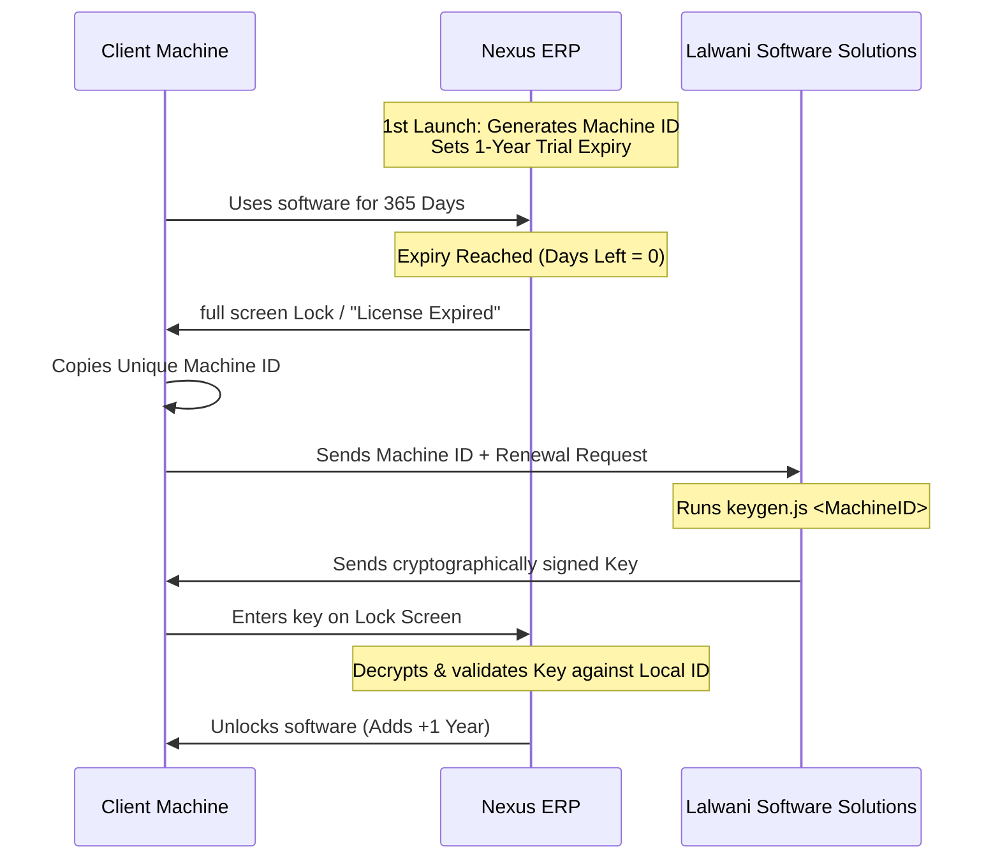

# Insurance Records Management System (Nexus ERP)
## Comprehensive Feature & License Operations Guide

Welcome to the **Nexus ERP** (Insurance Records Management System). This guide provides a detailed overview of the system's core capabilities, administrative modules, data security practices, and its machine-bound licensing renewal mechanism.

---

## 📂 Table of Contents
1. [Executive System Overview](#1-executive-system-overview)
2. [Core Modules & Features](#2-core-modules--features)
3. [Data Security: Backup & Restoration](#3-data-security-backup--restoration)
4. [Licensing & Activation System](#4-licensing--activation-system)
5. [Step-by-Step License Renewal Workflow](#5-step-by-step-license-renewal-workflow)

---

## 1. Executive System Overview
**Nexus ERP** is a standalone, secure desktop Enterprise Resource Planning (ERP) application designed specifically for insurance teams and agencies. It enables administrators to manage clients, track policy rosters, compute hierarchical sales performance, and handle operational commissions dynamically.

Built with **Electron**, **React**, and an encrypted **SQLite** database, the application operates locally on the host machine. It combines a premium obsidian dark-mode interface with real-time analytics, automated date triggers, and secure database tools.

---

## 2. Core Modules & Features

### 📊 Executive Dashboard
* **Dynamic KPIs**: Instant visual summaries of total policy registers, active policies, total premium collections (broken down by First Year and Second Year premiums), and overall targets.
* **Interactive Data Visualization**: Real-time charts detailing business development curves, recruitment performance, and sales target fulfillment (First-Year Premium vs. Target achieved).
* **Announcement & Notifications Widget**: Automatically flags policies approaching their anniversary dates, warning you of upcoming premium collections.

### 👤 Proposer Register (Client Directory)
* Complete biographical records directory for policy proposers (clients).
* Captures and stores contact details, relationship statistics, and profile details to keep customer touchpoints in a central roster.

### 📜 Policy Register (Central Roster)
* **Policy Lifecycle Tracking**: Manages complete records of active, lapsed, and pending insurance policies.
* **Hierarchical Association**: Links each policy directly to a Proposer, Sales Representative (SR), Sales Manager (SM), and Senior Sales Manager (SSM).
* **Automatic Commission & Date Log**: Integrates directly with date engines to track first-year premiums (Total Business) and second-year premiums (payments made between Year 1 and Year 2 of the policy anniversary).
* **PDF Export Utility**: Export professional, clean layouts of policy reports or individual summaries centered with custom headers at the touch of a button.

### 👥 Sales Organization Hierarchy
The system manages three layers of sales representatives in a clear hierarchical structure:
1. **Sales Representative (SR)**: Active field agents recording direct sales.
2. **Sales Manager (SM)**: Oversees SRs and acts as the mid-level coordinator.
3. **Senior Sales Manager (SSM)**: Directs regional operations and leads SSM sectors.

* **Roster Ranks**: Dedicated recruitment views (**SR Recruitment**, **SM Recruitment**, and **SSM Recruitment**) manage join dates, active lists, and operational targets for each tier.
* **Show Team (Interactive Tree)**: A visual organizational chart tool mapping the structural layout of agents (SSMs ➜ SMs ➜ SRs) showing reporting lines.

### 📈 Business Figures & Analytics
* Deep analytics panel that calculates target margins vs. actual collections.
* Dynamic calculation of operational figures directly linking to policy outcomes (correcting joins to ensure accurate accounting even for policies without direct SR tags).

### ⚙️ System Settings
* **Operator Session Panel**: Manage active administrator credentials and profiles.
* **Developer Support Card**: Direct contact cards for software developers (**Subhas Prem** & **Basit Ali**) with dynamic buttons to trigger WhatsApp messages, phone calls, or emails for rapid maintenance.
* **License Panel**: Displays the active license key, expiration dates, and days remaining on the active license.

---

## 3. Data Security: Backup & Restoration
To ensure high data integrity and protection against hardware failures, Nexus ERP has a built-in backup utility:

* **Creating a Backup**:
  - Compresses the SQLite database (`pms.db`) along with system state configs into a secure, timestamped ZIP archive.
  - Automatically exports the archive for easy offsite storage (external drives, email, cloud storage).
* **Restoring a Backup**:
  - The operator can select any valid backup ZIP file directly from the Settings screen.
  - The software safely terminates active database connections and closes write-locks.
  - Unzips and replaces the active database and config layers, then re-initializes the state immediately without requiring a full application restart.

---

## 4. Licensing & Activation System
Nexus ERP features a state-of-the-art, machine-bound cryptographic license system that prevents unauthorized software redistribution.



### 🔒 Core Licensing Concepts
* **Machine Binding**: On the first launch, the software uses the host computer's hardware configuration (CPU, motherboard, hard drive signatures) to generate a **Unique Machine ID**. The license is bound to this ID and cannot run on another PC.
* **Subscription Check**: Every time the app starts, it checks the local encrypted system configuration file (`sysconfig.dat`).
  - **Valid Status**: If there are more than 30 days left, the app runs normally.
  - **Expiring Status**: When under 30 days remain, a warning banner appears on the top of the interface showing the days left.
  - **Expired Status (Fullscreen Lock)**: Once the expiration date is reached, the application locks down. It blocks the main interface and redirects the user to a secure **License Renewal** screen.

---

## 5. Step-by-Step License Renewal Workflow

If the license has expired (or is expiring soon), the renewal process is executed as follows:

### Step 1: Copy the Unique Machine ID
When locked out, the user is presented with the License Renewal page. 
* Click the **COPY** button next to the **Unique Machine ID** (e.g. `e3d238b9-8e7c-473d-82d2-83b4fa81729b`) to copy it to the clipboard.

### Step 2: Request an Activation Key
* The client sends this Machine ID to **Lalwani Software Solutions** (via the contact options provided on the settings page, such as WhatsApp or Email).

### Step 3: Generating the Key (For Developers)
Using the developer's key generator utility (`keygen.js`), the developer runs:
```bash
node keygen.js <Machine-ID>
```
* **How the Key is Computed**: The script takes the client's `Machine ID`, appends the current timestamp, and signs it using a secure salt (`LIC_SALT_DEV_2026`) via **AES-256-CBC** encryption.
* The generator outputs a secure, cryptographically hashed activation string.

### Step 4: Activating the Software
* The client receives the generated activation key and pastes it into the **Renewal Key** input box on the License Renewal page.
* Click **Activate License**.

### Step 5: System Verification & Unlock
* The application decrypts the pasted key using the built-in decryption key.
* It extracts the encoded Machine ID and verifies it against the current machine's physical hardware ID.
* **Success**: If they match, the system adds **1 year (365 days)** to the expiration date, saves the updated settings into `sysconfig.dat`, resets the email notification thresholds, and unlocks full access to the application immediately.

---
> [!NOTE]  
> All configurations, license validations, and database files are encrypted locally. License keys are strictly system-bound, ensuring absolute security for your software intellectual property.
>
> **Lalwani Software Solutions**  
> *Copyright @ Lalwani Software Solutions. All rights reserved.*
