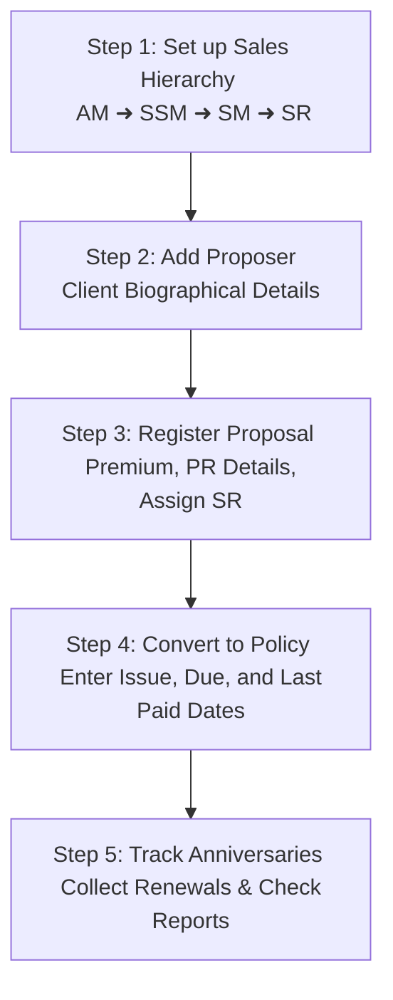

# Comprehensive Operations & User Guide
## Insurance Policy Records Management System (ERP Client Version)

Welcome to the **Insurance Policy Records Management System**. This operations guide provides detailed instructions on how to install, configure, operate, and maintain the system.

---

## 📂 Table of Contents
1. [Installation & Setup Walkthrough](#1-installation--setup-walkthrough)
2. [First-Time Launch & Default Profiles](#2-first-time-launch--default-profiles)
3. [Interface Navigation & Design System](#3-interface-navigation--design-system)
4. [Keyboard Navigation Shortcuts & Hotkeys](#4-keyboard-navigation-shortcuts--hotkeys)
5. [The System Operation Flow](#5-the-system-operation-flow)
6. [Hierarchical Recruitment (AM ➜ SSM ➜ SM ➜ SR)](#6-hierarchical-recruitment-am--ssm--sm--sr)
7. [Client & Proposal Roster](#7-client--proposal-roster)
8. [Policy Register & Lifecycles](#8-policy-register--lifecycles)
9. [Mathematical Formulas & Calculations Engine](#9-mathematical-formulas--calculations-engine)
10. [Anniversary & Birthday Notifications](#10-anniversary--birthday-notifications)
11. [Exporting Reports (PDF & Excel)](#11-exporting-reports-pdf--excel)
12. [Backups, Restorations, and Database Resets](#12-backups-restorations-and-database-resets)
13. [Licensing, Trial, and Clock Rollback Locks](#13-licensing-trial-and-clock-rollback-locks)
14. [Developer Support Channels](#14-developer-support-channels)

---

## 1. Installation & Setup Walkthrough

The application is distributed as a single standalone setup package. Follow these steps to install the system on a client computer:

### Step 1: Locate the Installer Executable
* Locate the installer file: `Insurance Policy Records Management System Setup 1.0.1.exe`.

### Step 2: Launch the Installer
* Double-click the installer file to run it.
* > [!IMPORTANT]
  > Because the application interacts with system directories and manages a local SQLite database, the installer requires **Administrator Privileges**. When the Windows User Account Control (UAC) prompt appears, click **Yes** to authorize the installation.

### Step 3: Choose Installation Options
* **Installation Folder**: Choose the directory where the application will be installed (default is `C:\Program Files\Insurance Policy Records Management System`).
* **Shortcuts**: The installer will automatically:
  - Create a **Desktop Shortcut** for quick access.
  - Register a **Start Menu Shortcut** in your programs list.
* Click **Install** to proceed.

### Step 4: Finish Installation
* Once the progress bar reaches 100%, click **Finish**. You can choose to launch the application immediately by checking the "Run application" box.

---

## 2. First-Time Launch & Default Profiles

On first launch, the software establishes its operational configurations and sets up the encrypted database.

### 🏢 Initial System Seeding
* If the system detects a fresh installation, it copies the packaged template database (`sysconfig.dat`) into the user's secure application data directory (`AppData\Roaming`).
* The system automatically initializes a **3-Day Trial Version**. The countdown starts strictly when the first operator logs into the system.
* **Background Security Alert**: The app generates a dynamic profile containing the machine's physical hardware configurations and sends an automated installation alert to the developers in the background.

### 🔑 Seeded Administrator Accounts
Use these default credentials to log in for the first time:

| Profile Role | Default Username | Default Password | Access Scope |
| :--- | :--- | :--- | :--- |
| **Developer Operations** | `developer` | `Dev@1234` | Full system access + Database Reset + App Packaging. |
| **Business Administrator** | `admin` | `Admin@1234` | Roster entries, Dashboard, Target controls, Reports, backups. |

> [!TIP]
> Log in as `admin` or `developer` and immediately navigate to **Users** (accessible from the sidebar) to add your custom operators, change passwords, and disable default accounts.

---

## 3. Interface Navigation & Design System

The system has a dark mode interface with visual indicators:

* **Top Navigation Bar**: Displays your current logged-in profile name, active system role, database status, and a logout button.
* **Active Status Banner**: If your license is expiring within 30 days, a warning banner will appear at the top showing the remaining days in red.
* **Left Sidebar**: Access all workspaces (Dashboard, Policy Register, Team Recruitment, Reports, Settings).
* **Form Inputs**: Require clicking inside the input box to focus. Visual styling (red borders) highlights missing or invalid data.

---

## 4. Keyboard Navigation Shortcuts & Hotkeys

You can operate the system much faster by utilizing keyboard shortcuts.

### ⌨️ F1-F12 Workspace Hotkeys
Jump directly to any page inside the ERP from anywhere by pressing:

* **F1**: Executive Dashboard
* **F2**: Proposer Register (Client Directory)
* **F3**: Policy Register (Anniversary Log)
* **F4**: SR Recruitment
* **F5**: SM Recruitment
* **F6**: SSM Recruitment
* **F7**: Area Manager Directory
* **F8**: Show Team (Hierarchy Map)
* **F9**: Business Figure (Analytics & Targets)
* **F10**: Notifications (Anniversaries & Birthdays)
* **F11**: Settings & Backup Tools
* **F12**: Users (developer only)

### 🆕 Ctrl + N Creation Modal Shortcut
* When viewing any directory page (F2 through F7), press **Ctrl + N** to immediately pop open the "Add New" creation form, eliminating manual mouse clicks.

---

## 5. The System Operation Flow

To ensure data integrity, perform business registrations in the following logical sequence:



---

## 6. Hierarchical Recruitment (AM ➜ SSM ➜ SM ➜ SR)

The system records sales performance across a structured organizational chain:

$$\text{Area Manager (AM)} \longrightarrow \text{Senior Sales Manager (SSM)} \longrightarrow \text{Sales Manager (SM)} \longrightarrow \text{Sales Representative (SR)}$$

### 📋 Field Input Rules
* **Name Fields**: letters, spaces, dots `.`, and hyphens `-` only. Numbers/symbols are rejected.
* **CNIC Fields**: Typing auto-formats digits into `XXXXX-XXXXXXX-X` format.
* **Contact Numbers**: Limited to 11 or 12 digits. No `+` or spaces allowed.
* **Date of Birth (DOB) & Join Date**: Input formatted to `DD/MM/YYYY` dynamically. Clicking the calendar icon opens the date picker. Future dates are blocked, and age must be between 0 and 120.

### 🔗 Dynamic Parent Mapping
* **Area Manager (AM)**: Independent top-level profile.
* **SSM Profile**: Requires choosing an assigned **AM**.
* **SM Profile**: Requires choosing an assigned **SSM**. Once chosen, the assigned **AM** is automatically populated.
* **SR Profile**: Requires choosing an assigned **SM**. Once chosen, the assigned **SSM** and **AM** are automatically populated.

---

## 7. Client & Proposal Roster

### 1. Register Client (Proposer)
* Navigate to **Proposer Register** (or press **F2**).
* Enter client bio details (Holder Name, CNIC, Phone, Address).

### 2. Enter Proposal
* Create a Proposal by entering: Proposal No (code format), Premium, PR No, PR Date, and Payment Method.
* Assign the **SR** who closed the sale. The parent SM, SSM, and AM hierarchy links will auto-populate.
* **Convert to Policy**: Click the "Convert" button next to any approved proposal to copy all information to the Policy Register.

---

## 8. Policy Register & Lifecycles

The **Policy Register** manages active insurance plans.

### 📅 The Key Dates
* **Issue Date**: The date the insurance policy was activated.
* **Due Date**: The date the annual renewal premium is due.
* **Last Paid Date**: The date the client made their last premium payment.
* > [!IMPORTANT]
  > Dates must follow the `DD/MM/YYYY` format. Always use the hybrid calendar picker icon on the input fields to prevent spelling or formatting mistakes.

---

## 9. Mathematical Formulas & Calculations Engine

The system performs calculations based on these formulas:

### 1. First-Year Premium (Total Business)
* **Definition**: Total business is the sum of the premiums for all policies sold under an agent.
* **Formula**:
  $$\text{Total Business} = \sum \text{Premium of all policies assigned to the agent's chain}$$

### 2. Second-Year Premium (Renewal Performance)
* **Definition**: Aggregated premium renewals collected during the second year of the policy lifecycle.
* **Capping & Eligibility Rule**: A policy's premium is counted in this metric if and only if the `Last Paid Date` falls within the second-year window relative to the original `Due Date`:
  $$\text{Due Date} + 1 \text{ Year} \le \text{Last Paid Date} < \text{Due Date} + 2 \text{ Years}$$
* **Exclusion**: Payments made before Year 1 (first-year premium) or on/after Year 2 (third-year premium and beyond) are automatically excluded.

---

## 10. Anniversary & Birthday Notifications

The **Notifications** workspace (press **F10**) tracks upcoming renewals and birthdays.

### 🔍 Filtering Alerts
Use the select dropdown to filter notifications by:
* **All Reminders**: Displays both birthdays and payment renewals.
* **Birthdays**: Shows birthdays within the next 30 days for Policyholders, SRs, SMs, SSMs, and AMs.
* **Policy Payment Renewals**: Shows policies whose renewal premium due date is within 30 days.

### 💬 WhatsApp Reminders
Click the **WhatsApp** icon on any alert card to open a pre-formatted message in WhatsApp:
* **Birthday Greeting**:
  > *"Assalam o Alaikum [Name], wishing you a very Happy Birthday! May you have a blessed and wonderful year ahead. Best regards Lalwani Software Solutions."*
* **Renewal Request**:
  > *"Assalam o Alaikum [Name], this is a friendly reminder that the renewal premium for Policy No. [PolicyNo] is due on [DueDate]. Kindly make your payment of Rs. [Amount] to keep your coverage active. Best regards Lalwani Software Solutions."*

---

## 11. Exporting Reports (PDF & Excel)

### 🖨️ PDF Reports
* Generates a clean, printed copy of Dashboard summaries, business curves, and hierarchy target achieve charts. Perfect for presentations.

### 📊 Excel Spreadsheets
* Exports full database tables (including all columns) matching your current search filters. Essential for deep analysis and external accounting records.

---

## 12. Backups, Restorations, and Database Resets

Navigate to **Settings** (press **F11**) and scroll to **System Operations**:

### 💾 Create Database Backup
1. Click **Create Backup**.
2. The system bundles the database and configuration files into a compressed, timestamped ZIP archive.
3. Save the ZIP file to an external drive or cloud storage.

### 🔄 Restore Database Backup
1. Click **Restore Backup**.
2. Select your backup ZIP archive.
3. The system terminates active database locks, replaces the database and configs, and re-loads your views immediately without restarting the application.

### 🧹 Database Reset (Wipe Transactional Data)
* Click **Reset Database**. This wipes transaction records (policies, proposals, notification history, sales hierarchy logs) but **preserves all operator logins** to prevent locking you out of the system.

---

## 13. Licensing, Trial, and Clock Rollback Locks

The software uses a machine-bound license model to prevent unauthorized redistribution.

### 🔒 Operational Rules
1. **Machine Binding**: On first launch, the software uses the host computer's motherboard, CPU, and storage signatures to calculate a **Unique Machine ID**. The license activation is strictly tied to this hardware signature.
2. **3-Day Trial Version**: Seeding the application creates a fresh 3-day Trial. The trial duration countdown starts strictly upon the first login of any operator profile.
3. **Clock Tampering Lockout**: If the computer's system clock is rolled back by more than 5 minutes, workspace access is suspended, displaying: *"System date manipulation detected. Please correct your system date."* Restoring the clock to the current date unlocks the system instantly.
4. **Carry-Forward Renewal**: Renewing or upgrading your key before it expires automatically adds your remaining days to the new license length.
5. **Redundant Configurations**: The license status is written to 3 separate backup locations: AppData, User Home directory, and the SQL database. If files are deleted, they auto-recover from the remaining backups.

### 🔄 License Renewal Steps
If your license expires or is expiring:

```
[Locked License Screen] ➜ Click "Copy Machine ID"
         ▼
[Send Machine ID to Support] ➜ (Support generates signed Key)
         ▼
[Enter Renewal Key in Box] ➜ Click "Activate License" ➜ [System Unlocks]
```

---

## 14. Developer Support Channels

For licensing keys, system updates, custom integrations, or database recovery, contact:

* **Subhash Prem (Software Engineer and Full Stack Developer)**
  * **Phone**: 0333-7104578 / 0315-2967527
  * **Email**: subhashprem4@gmail.com
  * **Office**: Lalwani Software Solutions

---
*Copyright © 2026 Lalwani Software Solutions. All rights reserved.*
